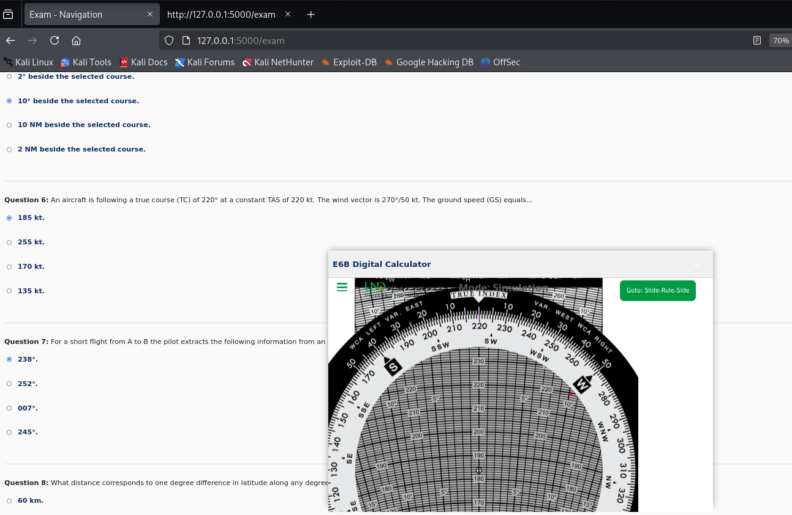

# SkyExaminer

A lightweight exam preparation tool for the **EASA PPL (Private Pilot Licence)** based on the official **AirAcademy ECQB-PPL** question database.

This tool allows students to simulate real exams, track their progress, and improve their performance over time by reviewing past mistakes



---

## ✈️ Features

- ✅ Uses official questions from [AirAcademy ECQB-PPL](https://aircademy.com/ecqb-ppl-en/)
- 🔀 **Dynamic question variants**: question answer options are shuffled each time to increase entropy
- 📊 **Performance tracking**: after each exam, incorrect answers are logged to allow analysis of repeated errors
- 📅 **3 Exam Modes**:
  - **Real Exam Simulation** (with countdown timer and real question count)
  - **General Practice Mode**
  - **Improve Mode** (focuses on questions previously answered incorrectly)
- 🧮 **Built-in E6B Navigation Tool**: integrated support for navigational questions via [UND E6B Trainer](https://mediafiles.aero.und.edu/aero.und.edu/aviation/trainers/e6b/)

---

## 📁 Folder Structure

- `answer_history/` — stores per-subject logs of incorrect answers with counts
- `PPL(A)_AirAcademy/` — contains the ECQB question database in CSV format
- `tmp/` — stores temporary exams
- `PPL(A)/`  — contains the ECQB question database in PDF format
- `app.py` — main execution 

---

## 💻 Installation (Windows & Linux )

1. **Clone or download** the repository:
```bash
git clone https://github.com/JoseAbreu28/SkyExaminer.git
cd SkyExaminer
pip install -r requirements.txt
```

2. **Run the app**:
```bash
python app.py
```

Make sure you have Python 3.x installed. No external dependencies are required unless GUI is implemented.

---

## 📜 License

This project is intended for **personal educational use only**. The question content belongs to [AirAcademy](https://aircademy.com) and is subject to their licensing terms.

---


